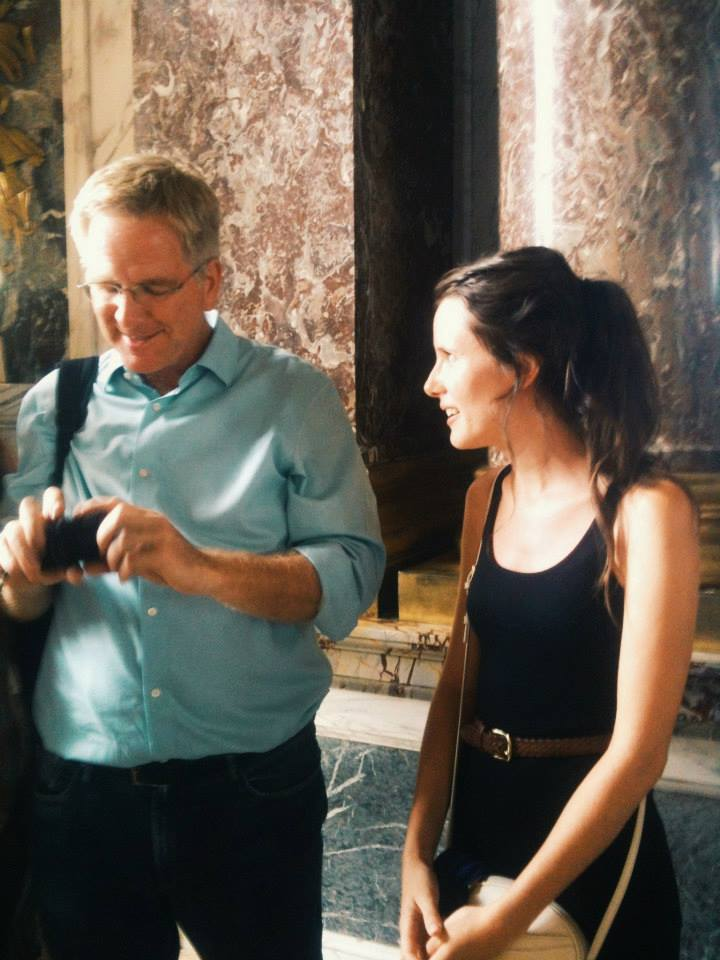

# hw01
Repository for homework 01

# Hannah's Biography

### Hi All! Here's a little about me: 
* Grew up in the Seattle Area
* Lived in Los Angeles Area prior to MAPSS
* I've worn many hats since undergrad:
    * Au pairing in France
    * Film Production
    * Interior Architecture and Design
    * Public Health Research

### Things I enjoy:
- Reading fiction
- Hiking / Backpacking
- Eating at *great* restuarants
- Spending time with fam & friends
- Thrifting
- Exploring Chicago
- Taking long walks with my GoldenDoodle

#### I am excited to gain some **solid skills** in this course! 

#### Feel free to reach out on LinkedIn: (https://www.linkedin.com/in/hannahemadison/)

#### And I will leave you with a picture of Rick Steves and me in the Hall of Mirrors at Versailles: 
