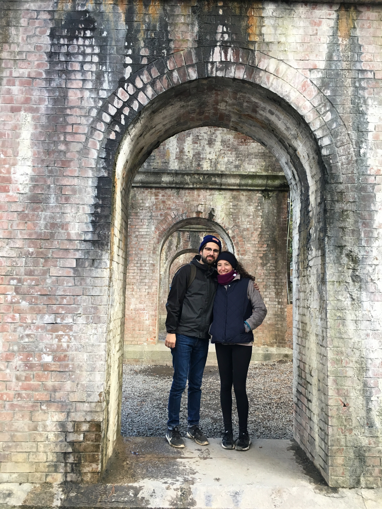

# hw01: About Me
Repository for homework 01

## **About Me**

My name is Elizabeth Huppert and I am a second-year PhD student in the psychology department.  I am looking forward to learning more about R in this course!

# **Background**
## *Undergraduate*

I was born in France, but grew up in the Chicago suburbs. I went to Bowdoin College in Brunswick, Maine, where I was a double major in Classics and Psychology. I moved back to Chicago after graduating and haven't left since.

## *Graduate School and Beyond*

After undergrad, I worked in healthcare advertising where I did market research for my clients. I enjoyed advertising, but left this job to go back to school in order to do a different type of research --- I now study moral decision-making.

# **My Research**
## *My Labs*

I am pursuing a joint degree between cognitive psychology and behavioral science at Booth School of Business. Currently I work in the Social Cognitive Neuroscience Laboratory and Child NeuroSuite, both led by Dr. Jean Decety in the psychology department. I also work in the Honesty Morality and Ethics (HOME) Laboratory, led by Dr. Emma Levine at Booth in the behavioral science department. 

## **Types of Research Projects**

In these labs, I am conducting research on a variety of projects related to morality. These include:  

* The development of children's fairness preferences 
* The influence of scarcity on moral decision-making in children and adults
* The social consequences of making absolute moral proclamations

## Here is my University of Chicago page in the Psychology Department
https://psychology.uchicago.edu/directory/elizabeth-huppert

# **Fun Stuff**
## *Japan*

My husband is in Japan all year for his dissertation research, which has given me the opportunity to spend two months living there this past fall. I get to go back for two months this summer! This picture is from a hike in Kyoto.

