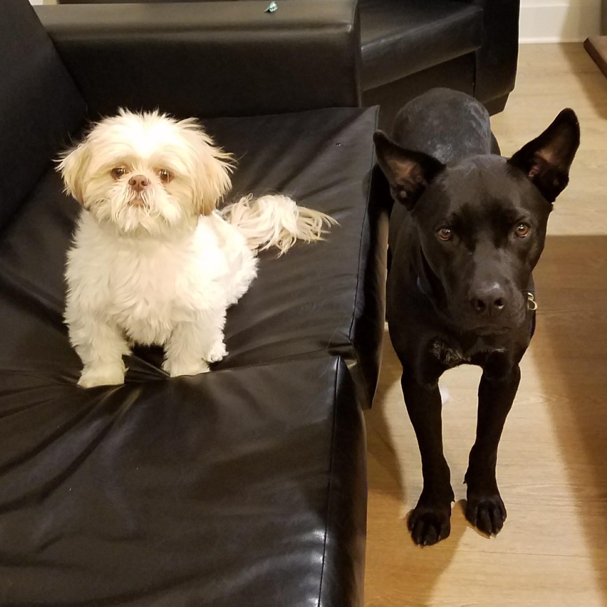

# A Beginner's Guide to __Kelsey Pagorek__
##### There are three main things a beginner should know about Kelsey Pagorek before encountering her in the wild: things to do, things to avoid, and how to disable.

### 1. Things to do
* Offer food
* Talk about Disney
* Bring a dog. Kelsey's family has a dog named Milo, who is objectively adorable. She also is helping her boyfriend raise a lovable mutt named Sirius. Sirius was named after Sirius Black from *Harry Potter* because he looks a bit like the character's animagus. Milo and Sirius are pictured below:

 

### 2. Things to avoid
* Do **NOT** take her food without asking. You don't want to be on the bad side of a hungry Kelsey
* Do **NOT** ask about post-graduation. This is a trap. The Kelsey is not a creature of simple answers. If you ask, you *will* inevitably be caught in a long-winded philosophical explanation about life motivations and what constitutes "success" (sprinkled with complaints about societal pressures and an abundance of tangential anecdotes, of course).

### 3. How to disable
* Introduce an existential crisis
* Play top hits from the 2000's on [Spotify!](https://open.spotify.com/playlist/2f6tXtN0XesjONxicAzMIw)