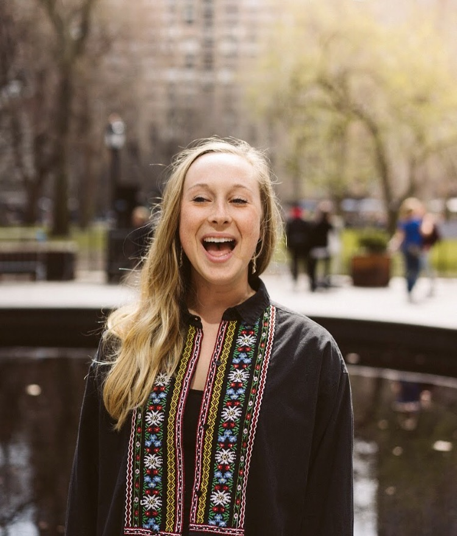

## Marie Pederson

#### MAPSS 2019, Sociology 

I am currently a graduate student at the University of Chicago studying the sociology of music. My research focuses on the emergence of sub-genres within indie music with an emphasis on alternative latin music. Additionally, I manage an indie artist called *Rodes Rollins*. 

Prior to coming to grad school I worked as a strategist for a consultancy called DoSomething Strategic. The company is the earned revenue source of DoSomething.org. A more detailed professional history can be found on [my LinkedIn](https://www.linkedin.com/in/mkfpederson/). 

To wrap up, here are a few additional facts about me: 

* I did my undergraduate degree at NYU. 
* I'm originally from Minnesota. 
* I speak fluent Spanish. 
* I'm obsessed with the zumba class offered at Ratner. 
